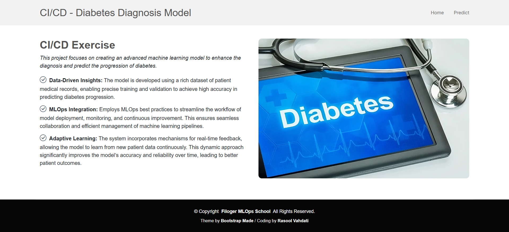

# Diabetes Diagnosis Prediction CI/CD Exercise

## Overview:
This project focuses on creating an advanced machine learning model to enhance the diagnosis and predict the progression of diabetes.

## Features:
- **Data Input for Prediction:** Users can input the necessary features (e.g., mean radius, texture, area) directly on the prediction form.
- **Model Prediction:** The model processes the input data and predicts whether the diabetes is low progression or high progression.
- **Result Display:** The prediction result is displayed on the result page, along with the provided input features.
- **Dockerized Application:** The application is packaged as a Docker container, allowing easy deployment and consistent environments across different systems. Users can run the application locally or on cloud platforms by simply using Docker commands.
- **CI/CD Workflow:** The project includes a Continuous Integration and Continuous Deployment (CI/CD) workflow that automates testing, building, and deploying the application, ensuring that new code changes are integrated smoothly and reliably into production environments.

## Screenshot of the Project:
