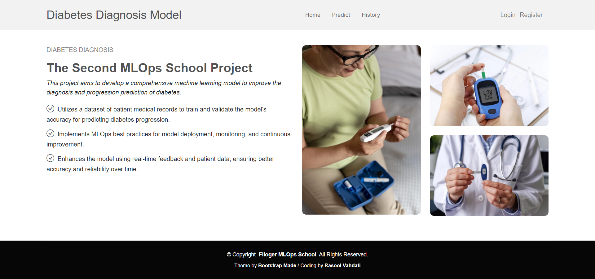

# Diabetes Diagnosis Prediction Project

## Overview:
This project is a sample application that predicts diabetes diagnosis using a trained model. The project is implemented using Flask and is containerized using Docker for easy deployment and scalability. To make a prediction, you first need to register on the website and log in. After logging in, you can go to the prediction page, fill in all the required input data, and submit it. The model will then make a prediction based on the provided data, and the result will be displayed on the results page.

## Features:
- **User Registration & Login**: New users must register, and existing users can log in to access the prediction page.
- **Data Input for Prediction**: Once logged in, users can input the necessary features (e.g., mean radius, texture, area) on the prediction form.
- **Model Prediction**: The model processes the input data and predicts whether the diabetes is low progression or high progression.
- **Result Display**: The prediction result is displayed on the result page, along with the provided input features.
- **Dockerized Application**: The application is packaged as a Docker container, allowing easy deployment and consistent environments across different systems. Users can run the application locally or on cloud platforms by simply using Docker commands.

## Demo Users:
You can use the following demo accounts to log in and test the application:

- **User 1**:
  - Username: `rasool`
  - Password: `123456789`

- **User 2**:
  - Username: `demo`
  - Password: `123!@#123`

## Screenshot of the Project:
